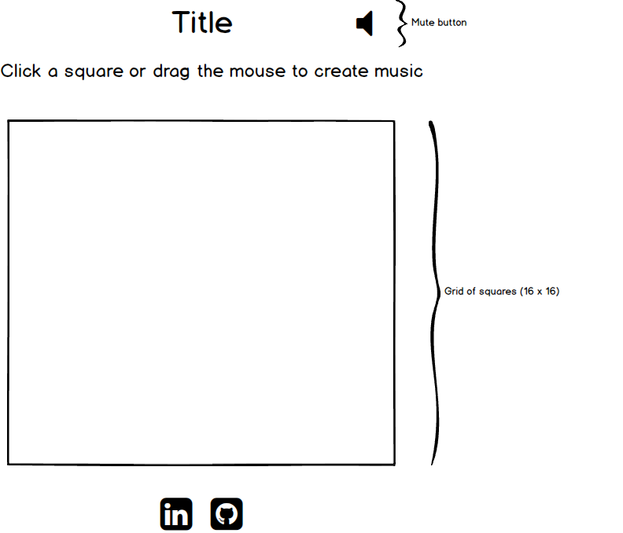

## ToneMatrix Musical Squares Clone

### Background

Tone Matrix is a musical player consisting of a grid, where each cell represents a single "sound". The sounds are played from the left-most column to the right-most column, with all cells in a single column being played at the same time. The row in a column contains a different note or sound.  

The original tone-matrix can be found [here](http://tonematrix.audiotool.com/)

### Functionality & MVP  

With this music player, users will be able to:

- [ ] Mute and reset the game board
- [ ] Select squares to be played in a loop
- [ ] Deselect squares to stop playing that sound

In addition, this project will include:

- [ ] Pulsating squares with glowing backgrounds when playing
- [ ] A production Readme

### Wireframes

This app will consist of a single screen with a grid of squares, a mute button, and a short instruction prompt, as well as nav links to the Github and my LinkedIn.

### Architecture and Technologies

This project will be implemented with the following technologies:

- Vanilla JavaScript and `jquery` for overall structure and game logic,
- Webpack to bundle and serve up the various scripts.

In addition to the webpack entry file, there will be three scripts involved in this project:

`board.js`: this script will handle the logic for creating and updating the necessary `Easel.js` elements and rendering them to the DOM.

`music.js`: this script will handle the logic behind setting up the grid and handling which columns get played at each interval.

`column.js`: this script will handle the logic for each column (all of which are identical). It will attribute a different tone to each square in that column.

`cell.js`: this script will set up the on/off logic behind a single tile object in the grid.

### Implementation Timeline

**Day 1**: Setup all necessary Node modules, including getting webpack up and running. Create `webpack.config.js` as well as `package.json`.  Write a basic entry file and the bare bones of all 3 scripts outlined above.  Learn the basics of using html5 audio tags. Begin looking at different sounds possibilities.  Goals for the day:

- Get a green bundle with `webpack`
- Learn how to get a single square to sound off an mp3 clip upon click.
-Choose 16 mp3 files to be used for each column.

**Day 2**: Finalize sounds that I am going to use. Begin Styling and creating the structure of the grid. Associate each cell with a particular mp3. Create the general display of the grid, set up columns and cells. Style to the point where it statically looks like Tone-Matrix. Get each square to play correct tone upon clicking it:

- Style to the point where it statically looks like Tone-Matrix.
- Make each cell in the grid clickable, toggling the state of the square on click from off to on.
- Make each cell sound off a noise when clicking it.

**Day 3**: Create the music logic behind playing each column in order in a loop. Goals for the day:

- Have a functional player that plays each column in order.

**Day 4**: Finish styling to make it look polished professional. Make sure everything is bug free. Add buttons to mute and reset grid.

- Create mute button
- Have everything looking professional
- Make squares emit light when playing

### Bonus features

Some features I would like to get to if I have time are:

- [ ] Add another grid for percussion sounds.
- [ ] Add randomly generated colors for each square. 
